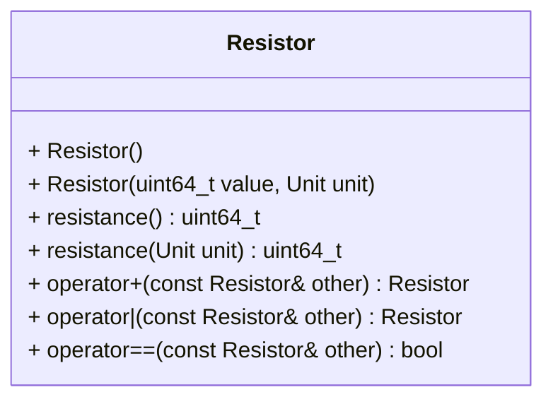

[](README.md)
[](README.de-at.md)


# Darstellung von Widerständen in Elektronikdesign-Software

Die in dieser Aufgabe enthaltenen Autotests sind explizit Teil der Angabe.
Darin verwendete Namespaces müssen korrekt implementiert werden.
Die folgenden Befehle müssen ausgeführt werden,
um die Richtigkeit der Lösung zu prüfen.
Es ist zu beachten, dass zum Kompilieren eine aktuelle Version von
`libcatch2-dev` installiert sein muss.

```shell
mkdir build && cd build
cmake ..
make -j4
make test
```

Alternativ zu `make test` können die einzelnen `test_*` Programme ausgeführt 
werden.


## Instructions
Ein Unternehmen vertreibt Software zur Unterstützung des Elektronikdesigns.
Die Software ist in C++ geschrieben und enthält zahlreiche Klassen zur
Darstellung elektronischer Bauteile.
Da der Code veraltet ist, ist die Darstellung von Widerständen inklusive ihrer
wichtigsten Operationen (Serien- und Parallelschaltung) neu zu implementieren.

Erstellen Sie eine Klasse `Resistor`, die einen Widerstandswert speichert.
Es muss möglich sein, Objekte dieser Klasse einfach in Parallel- und
Serienschaltungen zu kombinieren. Der Gesamtwiderstand von zwei oder mehr in
Serie geschalteten Widerständen entspricht der Summe ihrer Einzelwiderstände.

$$
R = \sum_{i=1}^n R_i = R_1 + R_2 + R_3 \cdots + R_n
$$

Um den Gesamtwiderstand aller Bauteile in einer Parallelschaltung zu berechnen,
addiert man die Kehrwerte der Widerstände $R_i$ und bildet den Kehrwert der
Summe.

$$
R = \left(\sum_{i=1}^n{1\over R_i}\right)^{-1} = \
\frac{1}{{1\over R_1} + {1\over R_2} + {1\over R_3} + \dots + {1\over R_n}}
$$

Im Fall von zwei Widerständen lässt sich der Ausdruck vereinfachen zu

$$
R = \frac{R_1 R_2}{R_1 + R_2}
$$

Es ist eine `enum class Unit` zu erstellen, um die folgenden Einheiten
zu repräsentieren:
`microohm`, `milliohm`, `ohm`, `kiloohm`, `megaohm`, `gigaohm` und `teraohm`.

Die neue Klasse muss das folgende API implementieren:



Der Standardkonstruktor muss einen neuen Widerstand mit 330 Ohm erzeugen.
Die Getter-Methode `resistance()` gibt den Widerstandswert in Mikroohm
zurück. Ihre Override muss den Wert (mathematisch auf ganze Zahlen gerundet)
in der gewünschten Einheit zurückgeben.
Der `operator+` muss einen neuen Widerstand mit dem Gesamtwiderstand der
beiden in Serie geschalteten Widerstände zurückgeben. `operator|` arbeitet
analog für zwei parallel geschaltete Widerstände.

Es ist zu beachten, dass bei der Berechnung des Parallelwiderstands
numerische Probleme aufgrund von `uint64_t`-Überläufen auftreten können. Um
diese Probleme zu vermeiden, ist es am einfachsten, die Berechnung
durchzuführen, nachdem die Werte in `double` umgewandelt wurden, und das
Ergebnis anschließend wieder in `uint64_t` zurück umzuwandeln.

Die Klasse und ihre Operatoren sind im Namespace `electronics` zu
implementieren. Die Header-Datei muss `resistor.hpp` und die
Implementierungsdatei `resistor.cpp` genannt werden.
