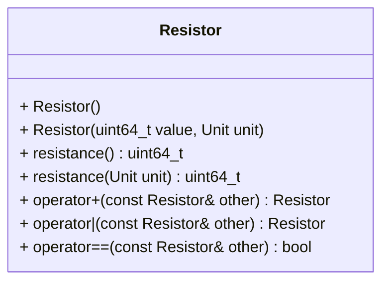

[](README.md)
[](README.de-at.md)


# Representing Resistors in Electronic Design Software

The autotests included in this task are explicitly part of the assignment.
The namespaces used in these tests must be implemented correctly.
After finishing the below tasks, run the following commands to see if your code
is correct. Note that a current version of `libcatch2-dev` has to be installed.

```shell
mkdir build && cd build
cmake ..
make -j4
make test
```

As an alternative to `make test` (or `ctest`) you can run the individual
`test_*` executables.


## Instructions

Your company sells standalone software that facilitates electronic design.
The software is written in C++ and contains many classes for representing
electronic components. Since the code is very old, your task is to rewrite
the representation of resistors including its most cruicial operations
(serial and parallel use).

Implement a class `Resistor` that holds a resistance value. It must be possible
to combine objects of that class for parallel and series circuits. The
total resistance of two or more resistors connected in series is equal to the
sum of their individual resistances

$$
R = \sum_{i=1}^n R_i = R_1 + R_2 + R_3 \cdots + R_n
$$

To compute the total resistance of all components in a parallel circuit,
add the reciprocals of the resistances $R_i$ and take the reciprocal of the
sum.

$$
R = \left(\sum_{i=1}^n{1\over R_i}\right)^{-1} = \
\frac{1}{{1\over R_1} + {1\over R_2} + {1\over R_3} + \dots + {1\over R_n}}
$$

In case of two resistances, the expression can be simplified to

$$
R = \frac{R_1 R_2}{R_1 + R_2}
$$

Create an `enum class Unit` to represent the units
`microohm`, `milliohm`, `ohm`, `kiloohm`, `megaohm`, `gigaohm` and `teraohm`.

Your class has to implement the following API:



The default constructor must generate a new Resistor with 330 ohms. The
`resistance()` getter must return the value in microohm. Its override
must return the value (mathematically rounded to integers) in the desired
unit. `operator+` has to return a new `Resistor` with the total resistance
of the two resistors in series. `operator|` does the same for two parallel
resistors.

Note that you will encounter numeric issues when calculating the parallel
resistance due to `uint64_t` overflows. To avoid the issues, the easiest way
is to perform the calculation after casting the values to `double` and cast
the result back to `uint64_t`.

Implement the class and its operators in the `electronics` namespace.
Name the header file `resistor.hpp` and the implementation file `resistor.cpp`.
